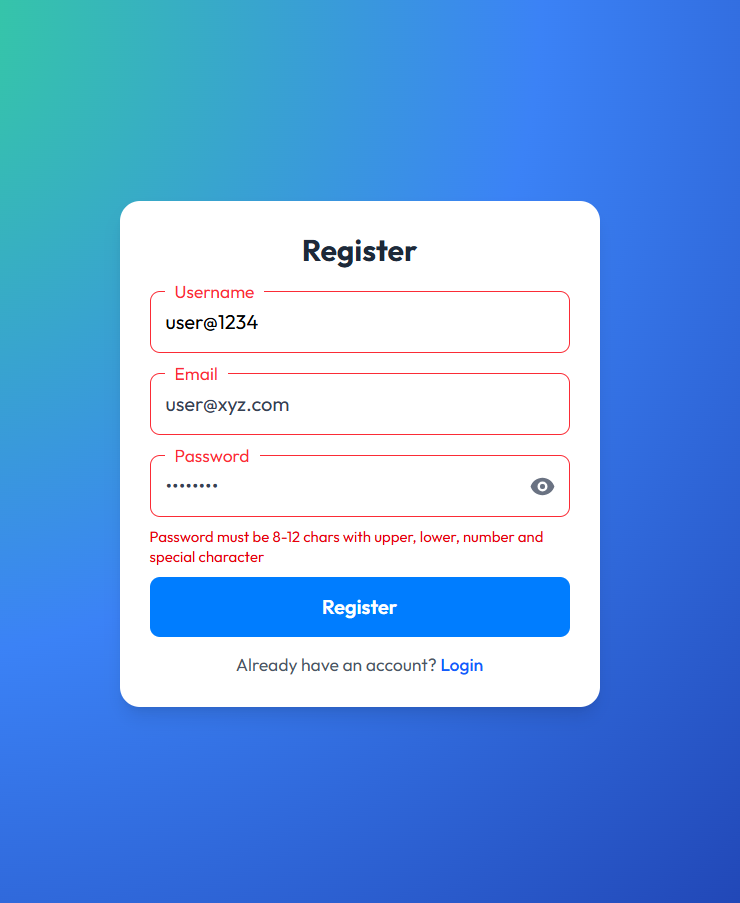
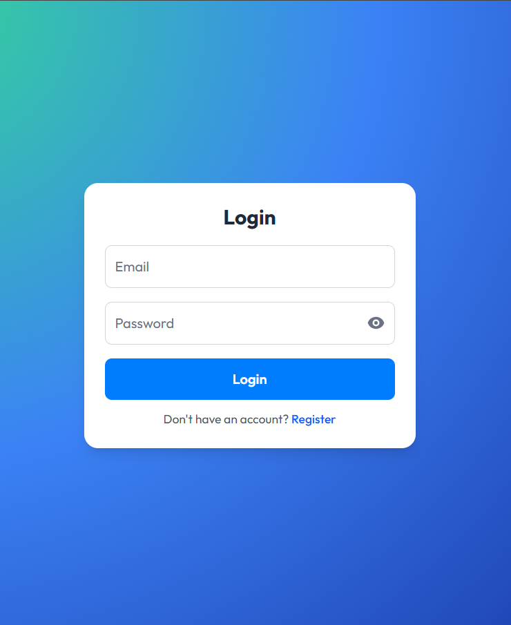
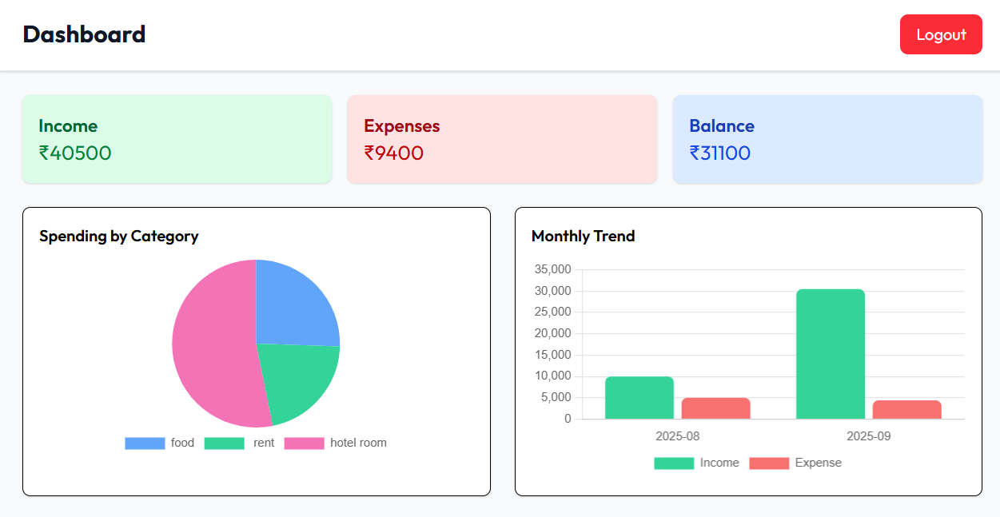
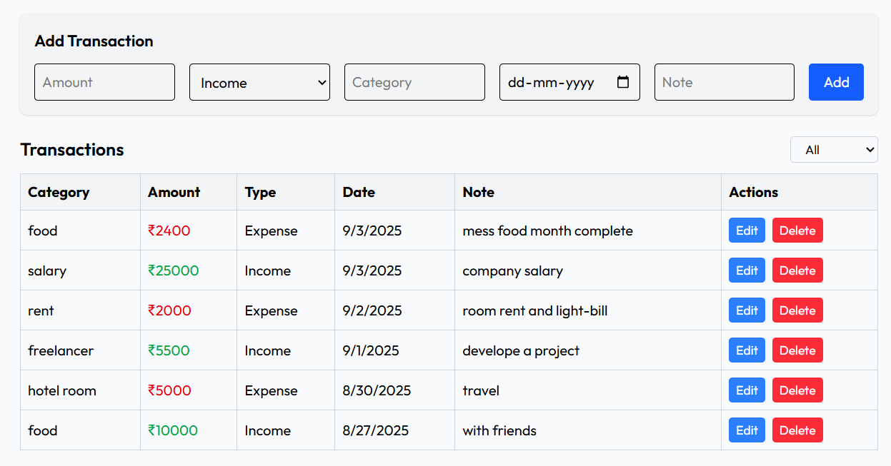

# Smart Finance - Personal Financial Tracker

A comprehensive personal finance tracker with authentication, transactions management, password reset functionality, and visual insights. Built with a Node/Express backend, MongoDB database, and a React + Vite frontend.

## 🚀 Features (Brief)

- Auth: Register, Login, Protected routes, Email OTP reset, JWT
- Transactions: CRUD, categories, filters, summaries
- Charts: Category pie, monthly bar, responsive with tooltips
- UX: Responsive UI, forms with validation, custom notifications/modals
- Profile: Edit first/last name, phone with country code, bio
- Email: Welcome email, password reset OTP

## 🛠 Tech Stack (Short)

- Frontend: React, Vite, Tailwind, React Router, Chart.js, React Icons
- Backend: Node.js, Express, JWT, bcryptjs, Nodemailer, Mongoose
- Database: MongoDB

## 🔒 Security

- Secure authentication (JWT)
- Passwords are hashed
- OTP-based password reset
- Input validation
- CORS protection


## 📁 Project Structure (Short)
```
smart-finance/
├─ backend/
│  ├─ controllers/
│  ├─ middleware/
│  ├─ models/
│  ├─ routes/
│  ├─ utils/
│  └─ server.js
└─ frontend/
   ├─ src/
   │  ├─ components/ (charts, forms, layout)
   │  ├─ pages/ (auth, dashboard, static)
   │  ├─ context/ (auth, notifications)
   │  ├─ utils/ (api, categories, reset store)
   │  ├─ App.jsx
   │  └─ main.jsx
   ├─ index.html
   └─ vite.config.js
```

## 📸 Screenshots

<p float="left">
  
  
</p>




## 🚀 Setup Instructions

### Prerequisites
- **Node.js** (v14 or higher)
- **MongoDB** (local installation or MongoDB Atlas)
- **Brevo Account** (free SMTP service for email delivery)

### 1. Backend Setup
1. Navigate to the `backend/` directory
2. Install dependencies:
   ```bash
   npm install
   ```
3. Create a `.env` file in `backend/` with:
   ```env
   MONGODB_URI=mongodb:<url>
   JWT_SECRET=<secret-jwt-key>
   PORT=5000
   
   # SMTP Configuration
   SMTP_HOST=<smtp-relay.com>
   SMTP_PORT=<port_number>
   SMTP_USER=<your-registered-email@domain.com>
   SMTP_PASS=<your-smtp-key>
   EMAIL_FROM=<your-registered-email@domain.com>
   ```
4. Start the backend server:
   ```bash
   npm start
   ```

### 2. Frontend Setup
1. Navigate to the `frontend/` directory
2. Install dependencies:
   ```bash
   npm install
   ```
3. Optionally set API base URL in `frontend/.env`:
   ```env
   VITE_API_BASE_URL=http://localhost:5000/api
   ```
4. Start the development server:
   ```bash
   npm run dev
   ```


## 📄 License

This project is licensed under the MIT License.

---

**Built with ❤️ for better financial management**

*Smart Finance - Your personal financial companion*
