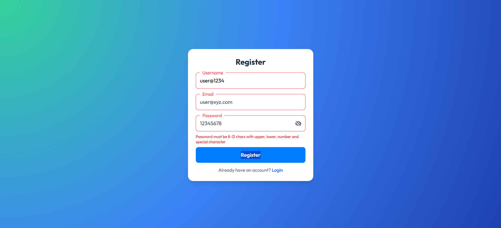
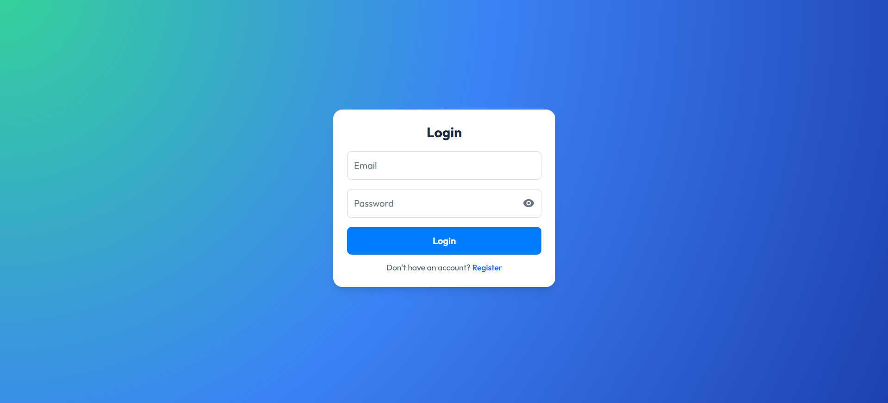
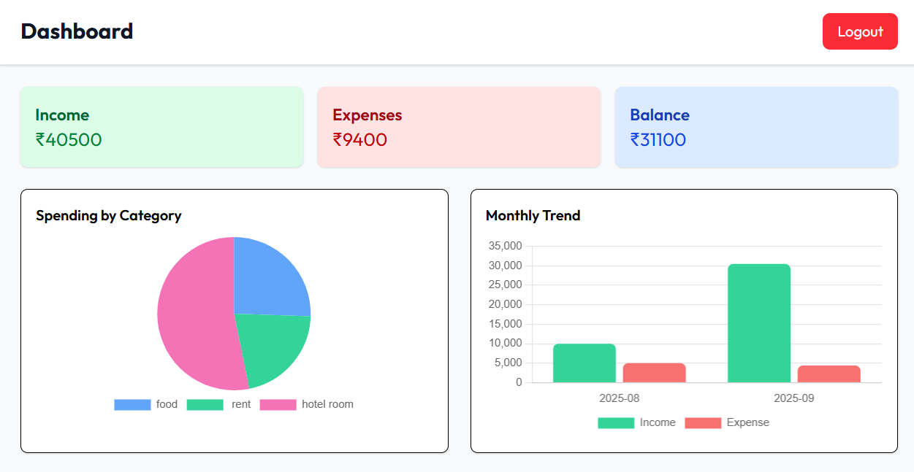

# Personal Financial Tracker

A comprehensive personal finance tracker with authentication, transactions management, password reset functionality, and visual insights. Built with a Node/Express backend, MongoDB database, and a React + Vite frontend.

## 🚀 Features

### 🔐 Authentication & Security
- **User Registration** - Secure account creation with strong password validation
- **User Login** - JWT-based authentication with session management
- **Password Reset Flow** - Complete forgot password functionality with OTP verification
- **Email Integration** - Welcome emails on registration and password reset OTPs
- **Route Protection** - Secure dashboard access with automatic logout on token expiry
- **Password Security** - Prevents reusing old passwords during reset

### 💰 Financial Management
- **Transaction CRUD** - Create, read, update, delete financial transactions
- **Income & Expense Tracking** - Separate tracking for income and expenses
- **Category Management** - Organize transactions by custom categories
- **Real-time Summary** - Live calculation of income, expenses, and balance
- **Transaction Filtering** - Filter by transaction type (All/Income/Expense)

### 📊 Data Visualization
- **Category Pie Chart** - Visual breakdown of spending by category
- **Monthly Bar Chart** - Monthly income vs expense trends over time
- **Interactive Charts** - Responsive charts with tooltips and legends
- **Real-time Updates** - Charts update automatically with new data

### 📱 User Experience
- **Responsive Design** - Optimized for desktop and mobile devices
- **Desktop Table View** - Comprehensive transaction table
- **Mobile Card View** - Touch-friendly card layout for mobile
- **Floating Labels** - Modern input styling with smooth animations
- **Loading States** - Proper loading indicators and error handling
- **Form Validation** - Client-side validation with user-friendly error messages

### 🔄 Password Reset Flow
- **Forgot Password** - Email/username-based password reset initiation
- **OTP Verification** - 6-digit numeric OTP sent to registered email
- **Secure Token** - Short-lived reset tokens for password changes
- **Resend OTP** - Cooldown-protected OTP resending with persistent countdown
- **Password Validation** - Strong password requirements with current password check

### 🌐 Additional Features
- **Timezone Support** - Local timezone configuration for accurate timestamps
- **Email Notifications** - Welcome emails and password reset notifications
- **Session Management** - Persistent login state with automatic cleanup
- **Error Handling** - Comprehensive error handling with user-friendly messages

## 🛠 Tech Stack

### Frontend
- **React** - Component-based UI framework
- **Vite** - Fast build tool and dev server
- **Tailwind CSS** - Utility-first CSS framework
- **React Router DOM** - Client-side routing
- **React Chart.js** - Data visualization library
- **React Icons** - Icon library for UI elements

### Backend
- **Node.js** - JavaScript runtime
- **Express** - Web application framework
- **JWT (jsonwebtoken)** - JSON Web Token authentication
- **bcryptjs** - Password hashing and comparison
- **Nodemailer** - Email sending functionality
- **Mongoose** - MongoDB object modeling

### Database
- **MongoDB** - NoSQL database with Mongoose ODM

## 📁 Project Structure
```
fin-tracker/
|
├─ backend/
|  |
│  ├─ controllers/     # Request handlers
│  ├─ middleware/      # Authentication middleware
│  ├─ models/          # Mongoose models (User, Transaction)
│  ├─ routes/          # API routes (auth, transactions)
│  ├─ utils/           # Email sender utility
│  └─ server.js        # Express server entry point
│
└─ frontend/
   |
   ├─ src/
   │  ├─ components/   # Reusable UI components
   │  ├─ pages/        # Page components
   │  ├─ context/      # React Context for state management
   │  ├─ utils/         # Utility functions (API, token storage)
   │  ├─ App.jsx       # Main application component
   │  └─ main.jsx      # Application entry point
   ├─ index.html
   └─ vite.config.js
```

## 📸 Screenshots

<p float="left">
  
  
</p>




## 🚀 Setup Instructions

### Prerequisites
- **Node.js** (v14 or higher)
- **MongoDB** (local installation or MongoDB Atlas)
- **Brevo Account** (free SMTP service for email delivery)

### 1. Backend Setup
1. Navigate to the `backend/` directory
2. Install dependencies:
   ```bash
   npm install
   ```
3. Create a `.env` file in `backend/` with:
   ```env
   MONGODB_URI=mongodb://localhost:27017/fin-tracker
   JWT_SECRET=your-super-secret-jwt-key
   PORT=5000
   
   # Brevo SMTP Configuration
   SMTP_HOST=smtp-relay.brevo.com
   SMTP_PORT=587
   SMTP_USER=your-registered-email@domain.com
   SMTP_PASS=your-brevo-smtp-key
   EMAIL_FROM=your-registered-email@domain.com
   ```
4. Start the backend server:
   ```bash
   npm start
   ```

### 2. Frontend Setup
1. Navigate to the `frontend/` directory
2. Install dependencies:
   ```bash
   npm install
   ```
3. Optionally set API base URL in `frontend/.env`:
   ```env
   VITE_API_BASE_URL=http://localhost:5000/
   ```
4. Start the development server:
   ```bash
   npm run dev
   ```

### 3. Usage
1. Visit the application in your browser (typically `http://localhost:5173`)
2. **Register** a new account with a strong password
3. **Login** to access your dashboard
4. **Add transactions** to track your income and expenses
5. **View charts** for visual insights into your spending patterns
6. **Use forgot password** if you need to reset your password

## 🔧 API Endpoints

### Authentication
- `POST /api/auth/register` - User registration
- `POST /api/auth/login` - User login
- `POST /api/auth/forgot-password` - Initiate password reset
- `POST /api/auth/verify-reset-otp` - Verify OTP for password reset
- `POST /api/auth/reset-password` - Reset password with token

### Transactions
- `GET /api/transactions` - Get user transactions
- `POST /api/transactions` - Create new transaction
- `PUT /api/transactions/:id` - Update transaction
- `DELETE /api/transactions/:id` - Delete transaction

## 🔒 Security Features

- **JWT Authentication** - Secure token-based authentication
- **Password Hashing** - bcryptjs for secure password storage
- **OTP Verification** - Time-limited OTP for password reset
- **Rate Limiting** - OTP retry limits to prevent abuse
- **Input Validation** - Server-side validation for all inputs
- **CORS Protection** - Cross-origin resource sharing protection

## 📝 Notes

- **Password Requirements**: 8-12 characters with uppercase, lowercase, number, and special character
- **OTP Expiry**: Password reset OTPs expire after 10 minutes
- **Token Security**: Reset tokens are short-lived and single-use
- **Timezone**: Database timestamps are configured for local timezone
- **Email Delivery**: Brevo SMTP service provides reliable email delivery with 300 emails/day free tier
- **User Deletion**: Deleting a user in the database will automatically log them out

## 🤝 Contributing

1. Fork the repository
2. Create a feature branch
3. Commit your changes
4. Push to the branch
5. Create a Pull Request

## 📄 License

This project is licensed under the MIT License.

---

**Built with ❤️ for better financial management**


